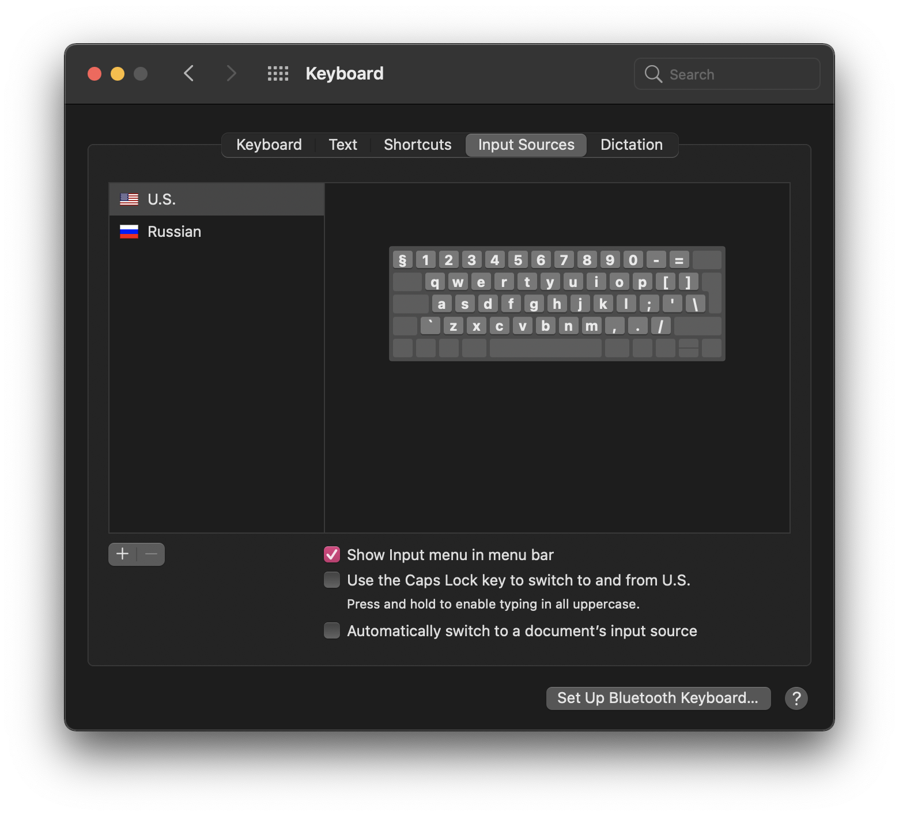
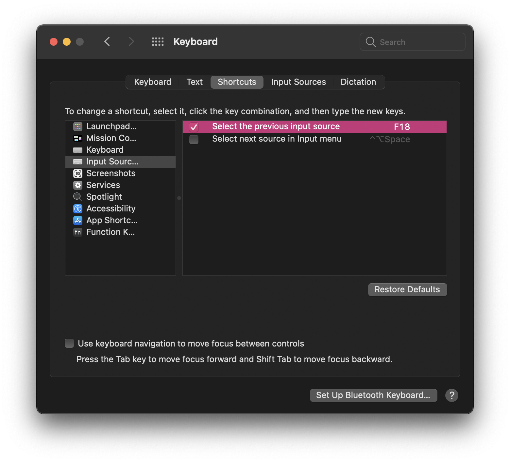

If you think about your keyboard a little bit and the way you use it, you might figure out that there are some keys on it that you barely use. One of such keys is Caps Lock key.

## Introduction

While Caps Lock key is intended to be used when you want to type something in *UPPERCASE*, most of the people tend to hold Shift key for that purpose. Now if you recuperate your thoughts, you might find yourself also doing it — in that case, I've got a solution for you and anyone else willing to make their Caps Lock key great again.

Fortunately, I've been not the first one to figure out that their Caps Lock key isn't used on a daily basis, thanks to Apple. If you take a look on your keyboard preferences, you might find a checkbox in there which changes the behavior of Caps Lock key.



Less fortunately is that, despite Apple's original idea of changing the way Caps Lock key works is great, it still has a drawback to it — the only out-of-box way to change key's behavior is to make it to change your input source as you can't use Caps Lock in any configurable keyboard shortcuts.

Even though that would be great for a lot of people, their implementation, for some reason, works from time to time giving massive headaches whenever you want to change your input source.

Some readers would already think about using a solution like [Karabiner-Elements](https://karabiner-elements.pqrs.org/) to remap their Caps Lock key, but as far as I'm concerned about, while Karabiner-Elements is a great tool for automating some actions in macOS, it causes [performance loss and other issues](https://github.com/pqrs-org/Karabiner-Elements/issues/593).

Besides that, I personally don't need any other keyboard automation, and it's a massive overhead to install an all-in-one keyboard fine-tuning solution just to remap one key's action.

So I came up with my own solution to it, which is native and won't require any additional software to be installed on your Mac!

## The solution

Solving the Caps Lock problem wouldn't require a lot of effort, simply copy and paste a snippet below to a new file at `~/Library/LaunchAgents/me.serpentiel.CapsLockToF18.plist`.

```xml
<?xml version="1.0" encoding="UTF-8"?>
<!DOCTYPE plist PUBLIC "-//Apple//DTD PLIST 1.0//EN" "http://www.apple.com/DTDs/PropertyList-1.0.dtd">
<plist version="1.0">
   <dict>
      <key>Label</key>
      <string>me.serpentiel.CapsLockToF18</string>
      <key>ProgramArguments</key>
      <array>
         <string>/usr/bin/hidutil</string>
         <string>property</string>
         <string>--set</string>
         <string>{
            "UserKeyMapping": [
               {
                  "HIDKeyboardModifierMappingSrc":0x700000039,
                  "HIDKeyboardModifierMappingDst":0x70000006D
               }
            ]
         }</string>
      </array>
      <key>RunAtLoad</key>
      <true />
   </dict>
</plist>
```

The snippet provided will effectively tell the operating system to interpret your Caps Lock key as [F18](https://en.wikipedia.org/wiki/Function_key#:~:text=function%20keys%20F13%20to%20F19%20have%20no%20labels%3B%20they%20were%20only%20available%20on%20full%20keyboards%20of%20fixed%20Apple%20computers%20(iMac%2C%20Mac%20Pro%2C%20or%20Mac%20Mini).%20All%20laptop%20computers%20have%20always%20lacked%20these%20extra%20keys%2C%20as%20well%20as%20any%20recent%20fixed%20Apple%20computer%20equipped%20with%20wireless%20Apple%20keyboard.), which will then allow to use the key in any kind of configurable shortcuts, including input source switching and basically anything else you want to do with your new unlimited Caps Lock key.



Once you save the file with the provided snippet, make sure to execute the following command to apply changes:

```bash
launchctl load -w ~/Library/LaunchAgents/me.serpentiel.CapsLockToF18.plist
```

You can also relogin to your current macOS user or restart your Mac to apply the changes.

## Conclusion

I always tend to find ways to improve my work environment and experience in any way possible, thus I recommend you to.

Maybe remapping Caps Lock key will not do it for you, but you shouldn't hesitate to experiment and try different kind of things which will ultimately lead you to fully convenient use of your computer.
